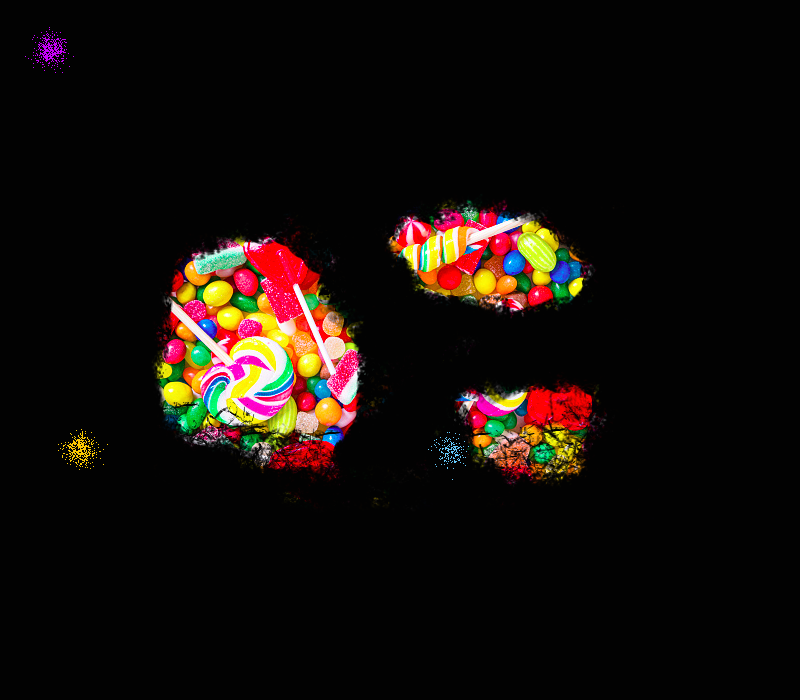

# AntNestCV (In progress)

Simple project implementing colony behavior using numpy and OpenCV.

TODO:

1. Implement food limit to each ant
2. Implement trail pheromone
3. Ants' behaviors to detect the trail and back to the colony
4. Food release
5. Fix low fps gifs
